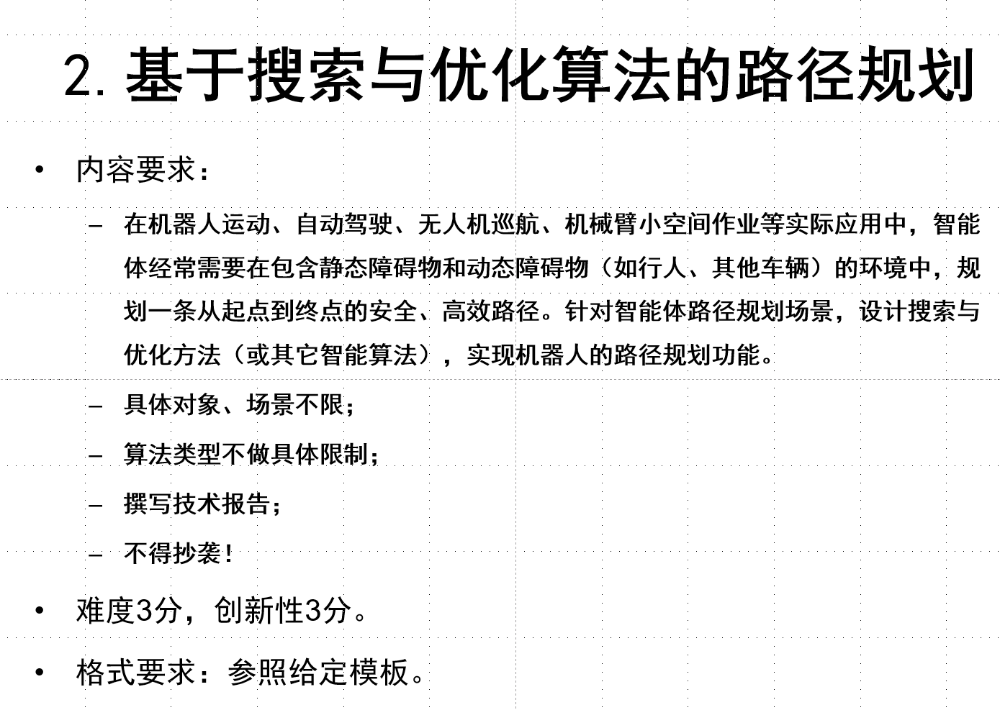
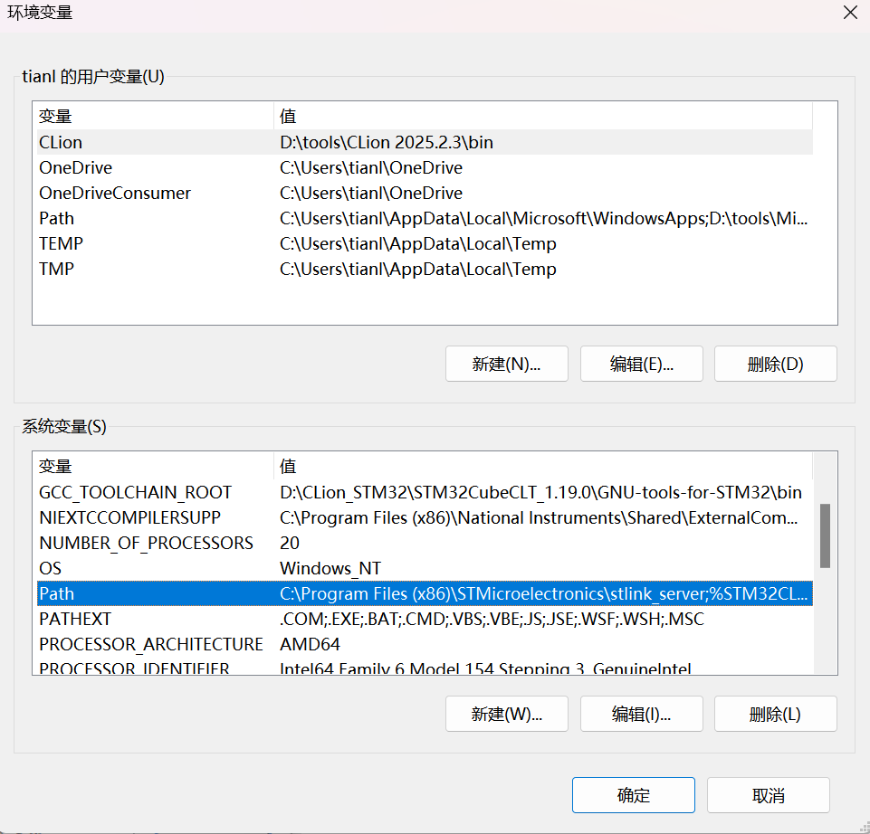
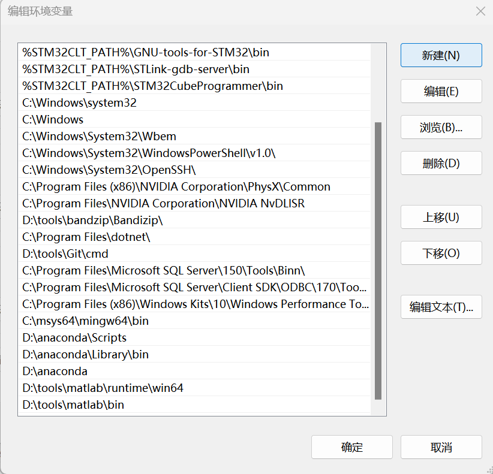

<!--
 * @Author: Nagisa 2964793117@qq.com
 * @Date: 2025-12-10 21:44:24
 * @LastEditors: Nagisa 2964793117@qq.com
 * @LastEditTime: 2025-12-31 00:37:39
 * @FilePath: \NJUST-AI-Assignment\README.md
 * @Description: 这是默认设置,请设置`customMade`, 打开koroFileHeader查看配置 进行设置: https://github.com/OBKoro1/koro1FileHeader/wiki/%E9%85%8D%E7%BD%AE
-->
# [NJUST-AI-Assignment(含本github项目超链接)](https://github.com/nagisa1201/NJUST-AI-Assignment)：田麟飞与万鹏的人工智能大作业Readme

## 题目回顾：


## 工程环境介绍
- 本工程基于**Anaconda环境**下的**Python3.11.13**，采用了**Pygame库**进行了类似迷宫游戏的仿真平台搭建，此外还使用了Python的常见heapq、numpy等常见库。

## 项目工程文件目录介绍
- 本工程文件较多，现分文件夹进行文件功能介绍。
### ai-assignment
#### imports
- 本文件夹下存放pyamaze的**pygame的maze迷宫类文件**，存放于该文件夹的目的是为了在后续算法模块、主模块、地图渲染模块**引用该迷宫类**。
#### algorithms
- 为本工程的**算法规划层** ，是工程中最为核心的**A\*算法簇与VO算法的模块化代码实现**文件夹，其中存放我们攥写的所有**算法代码文件**，以下为详细介绍。

| 文件名称 | 功能描述 |
| :--- | :--- |
| `algo_A_star.py` | **基础A\*全局路径规划算法实现** ，并实现了A\*算法的单独测试类，可以**运行该脚本进行无视动态障碍的纯静态最优寻路** |
| `algo_Weigted_star_sub.py` | **Weighted A\*算法的全局路径规划算法实现** ，单独启动此脚本时，会得到**大报告中Weighted A\*算法的参数扫描实验图** |
| `algo_Dynamic_Weighted_A_star.py` | **Dynamic Weighted A\*算法的全局路径规划算法实现** ，单独启动此脚本时，会得到**大报告中Dynamic Weighted A\*算法的参数扫描实验图**。 |
| `algo_improved_A_star.py`| **用于main函数模块的最终迭代版A\*算法即DWA\*算法实现** |
| `algo_VO.py` | **速度障碍法VO算法的局部避障算法的实现** ，用于动态障碍处理。 |

#### render
- 为本工程的**地图渲染层** ，在工程中实现**地图各组件定义和地图总渲染**的地图渲染类的文件。

#### main.py
- 为本工程的**main核心逻辑业务层** ，在工程中实现**算法规划层的接口调用与地图渲染层的接口调用，并处理地图各组件数据信息，进行算法调用规划，将结果展示在窗户上** 。

### readme_picture
- 存放**readme内插入图片的文件夹** 。


## 搭建环境与复现工程效果
- 本工程的环境配置较为简单，按照如下配置即可的到我们的全效果。

### 搭建环境
- 点击本文件夹中的Anaconda3-2025.06-0-Windows-x86_64.exe文件下载Anaconda，并***添加Anaconda的环境变量（重要，否则在CMD中无法conda activate进入虚拟环境）*** 。
- 具体的添加环境变量方式[可见该帖](https://blog.csdn.net/yinjun3215/article/details/123705879)，重点为在Windows的**环境变量(N)...** 中，双击**系统变量Path**，**新建三条环境变量**



```bash
D:\python-package\anaconda3  # 具体根据您下载的Anaconda环境路径有关
D:\python-package\anaconda3\Scripts  # 但anaconda3与Scripts、Library的相对路径关系不变
D:\python-package\anaconda3\Library\bin
```
- 随后，打开CMD，在本文件夹 **（即NJUST-AI-Assignment文件夹下）** 执行如下命令
```bash
conda create -n njust_ai python=3.11 # 此后的全选择Yes
conda activate njust_ai
pip install pyamaze tk pygame numpy
```
- 执行完上述步骤后该环境配置完成！
### 复现工程
- 打开任意**可调试、运行Python的一款IDE，并打开本工程主文件夹**
- 在 **\NJUST-AI-Assignment目录下（此步极为重要，文件中含有os库的文件处理，不按照该路径会导致文件路径错误）** ，执行如下代码：
```bash
python ./ai-assignment/main.py   
```
- 此后按照提示输入所有指标，即可得到弹出窗口的机器人在**含动态障碍物的迷宫内的路径规划与动态避障效果** （从起点到随机终点）

